  

<table align="center" width="80%">
  <tr>
    <td width="64%" valign="top">
      <h3>atuação</h3>
      
Infraestrutura de TI, Linux, servidores VPS, redes, segurança e suporte técnico avançado.

      <h3>projetos</h3>
      
Da aplicação à infraestrutura: desenvolvimento web, deploy, monitoramento e serviços preparados para o uso diário.

    </td>
    <td width="36%" valign="top" align="right">
      
<em>“sistemas estáveis, serviços seguros e ideias no ar.”</em>

      
<a href="https://itsuanz.website">itsuanz.website</a> <a href="https://www.tiktok.com/@uanzindead">TikTok · @uanzindead</a>

    </td>
  </tr>
</table>

  Kauan Rodrigues · Uanzin Dev

